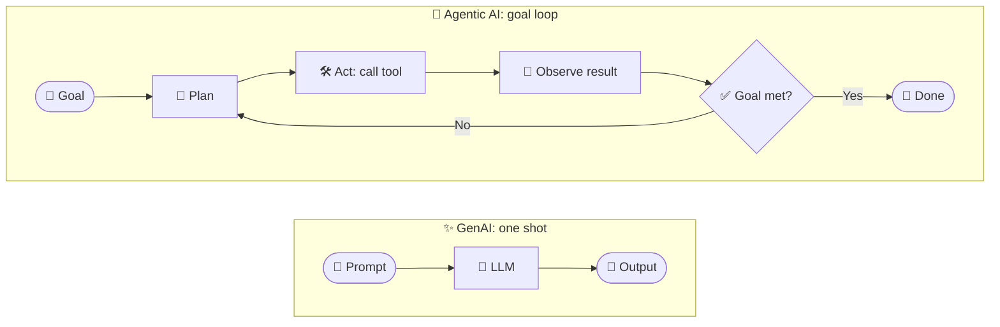

<!-- Optional: to render Remix Icons (<i class="ri-...">) add this to your docs site/HTML head:
<link href="https://cdn.jsdelivr.net/npm/remixicon@4.2.0/fonts/remixicon.css" rel="stylesheet"> -->

# <i class="ri-robot-2-line"></i> 🤖 GenAI vs Agentic AI

> <i class="ri-lightbulb-flash-line"></i> 💡 **One-liner:** **GenAI** *creates* content when you ask. **Agentic AI** *pursues a goal*: it plans, uses tools, takes actions, checks results, and repeats until the job is done.

---

## <i class="ri-magic-line"></i> ✨ What is Generative AI?

GenAI models (LLMs, image models, etc.) take a **prompt** and produce an **output** (text, code, image). It is **reactive**: one request in, one response out.

- 💬 "Write an email to my boss."
- 🖼️ "Generate a logo."
- 🧑‍💻 "Explain this function."

**Limits:** it doesn't act in the world, doesn't remember across steps, and doesn't check if its answer actually worked.

---

## <i class="ri-rocket-line"></i> 🚀 What is Agentic AI?

Agentic AI wraps an LLM in a **loop with tools, memory, and decision-making** so it can work toward a **goal** autonomously.

- 🧠 **Plans** the steps
- 🛠️ **Uses tools** (search, APIs, databases, code execution)
- 👀 **Observes** results and **adapts**
- 🔁 **Repeats** until the goal is met (or asks a human 🙋)

---

## <i class="ri-scales-3-line"></i> ⚖️ Side-by-Side

| Aspect | <i class="ri-magic-line"></i> GenAI | <i class="ri-robot-2-line"></i> Agentic AI |
|---|---|---|
| 🎯 **Core idea** | Generate content | Achieve a goal |
| ⚡ **Behavior** | Reactive (prompt → response) | Proactive (plan → act → observe → repeat) |
| 🛠️ **Tools** | Usually none | APIs, search, DB, code, other agents |
| 🧠 **Memory** | Within one chat context | Short-term state + long-term memory |
| 🔁 **Loops** | Single pass | Multi-step, iterative |
| 🤝 **Human role** | Prompts every step | Sets the goal, approves key steps |
| 🌍 **Impact** | Produces text/images | Changes things (sends email, edits files, books tickets) |
| 💸 **Cost / risk** | Low | Higher (more calls, real side effects) |

---

## <i class="ri-git-branch-line"></i> 🗺️ The Difference in Flow

---

## <i class="ri-user-star-line"></i> 🧑‍🍳 Easy Analogy

| | Analogy |
|---|---|
| <i class="ri-magic-line"></i> **GenAI** | 📖 A **cookbook author**: gives you a great recipe when asked. |
| <i class="ri-robot-2-line"></i> **Agentic AI** | 👨‍🍳 A **chef**: reads the order, shops for ingredients, cooks, tastes, fixes it, and serves the dish. |

---

## <i class="ri-lightbulb-line"></i> 🧪 Same Task, Two Approaches

**Task:** *"Find the cheapest flight to Dubai next week."*

- ✨ **GenAI:** explains how to search for flights and gives general tips. *You* do the searching.
- 🚀 **Agentic AI:** queries flight APIs ✈️ → compares prices 💰 → checks your calendar 📅 → asks you to confirm 🙋 → books it ✅.

---

## <i class="ri-compass-3-line"></i> 🧭 When to Use Which

| Choose... | When |
|---|---|
| <i class="ri-magic-line"></i> ✨ **GenAI** | Single-step tasks: drafting, summarizing, translating, brainstorming, Q&A |
| <i class="ri-robot-2-line"></i> 🚀 **Agentic AI** | Multi-step goals needing tools, decisions, retries, or real-world actions |

> 🧩 **Rule of thumb:** if a single prompt can solve it, use GenAI. If it needs *steps, tools, or decisions*, build an agent.

---

## <i class="ri-flow-chart"></i> 🕸️ Where LangGraph Fits

GenAI is the **brain** 🧠. LangGraph is the **nervous system** that gives it structure:

- 🗺️ **Graph** of nodes and edges = the agent's workflow
- 💾 **State + checkpointer** = memory
- 🔀 **Conditional edges** = decisions
- 🔁 **Loops** = retry / reflect
- 🙋 **`interrupt()`** = human-in-the-loop

---

## <i class="ri-alert-line"></i> ⚠️ Common Misconceptions

- ❌ *"Agentic AI replaces GenAI."* → ✅ Agents are **built on top of** GenAI models.
- ❌ *"More agents = better."* → ✅ Start simple; add autonomy only when needed.
- ❌ *"Agents are fully autonomous."* → ✅ Good agents keep a **human in the loop** for risky actions.

---

## <i class="ri-checkbox-circle-line"></i> 🧠 Takeaway

| | GenAI | Agentic AI |
|---|---|---|
| **Answers** | "Here's what you could do." | "I did it. Here's the result." |
| **Formula** | LLM | LLM + Tools + Memory + Loop + Goal |