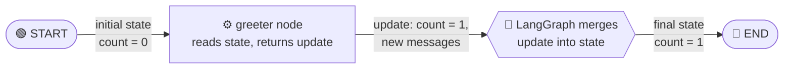
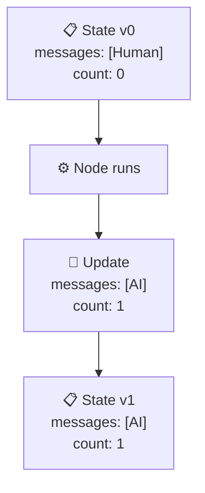

# 🧩 01: State

Welcome to the internals of LangGraph! 🎉 If you have used `create_agent` before, you have already used LangGraph without knowing it. Under the hood, every agent is a **graph**, and every graph runs on top of one core idea: **State**.

Understanding State is the single most important step in learning LangGraph. Once it clicks, everything else (nodes, edges, reducers, memory) becomes much easier. Let's go step by step. 🚀

---

## 📚 What You Will Learn

- 🧠 What State is and why LangGraph needs it
- 📐 What a **schema** is
- 🐍 How to define State with `TypedDict`
- ✍️ How nodes read State and return updates
- ▶️ How to build and run a complete graph
- 🔀 How LangGraph merges updates automatically

---

## 🧠 1. What Is State?

**State** is the shared data that flows through your graph while it runs. Every step of your program can look at it, and every step can add to it or change it.

### 🖼️ The Whiteboard Analogy

Imagine a team working on a project in a meeting room. In the middle of the room is **one shared whiteboard**.

- 👩‍💻 Person A walks up, reads the whiteboard, writes a new line, and sits down.
- 👨‍💻 Person B walks up, reads what Person A wrote, adds something else, and sits down.
- 👩‍🔬 Person C does the same.

The whiteboard is the **State**. The people are the **nodes** (we define that word properly soon). Nobody passes notes to each other directly. They all communicate through the whiteboard.

```
┌──────────────────────────────┐
│        📋 WHITEBOARD         │
│          (the State)         │
│                              │
│   messages: [...]            │
│   count: 3                   │
└──────────────────────────────┘
      ▲            ▲
      │ read/write │ read/write
   [Node A]     [Node B]
```

### 🤔 Why Not Just Use Normal Python Variables?

Good question! In a normal script you might use variables or function arguments. But graphs are different:

- 🔁 Steps may run in loops or branches, and you do not know the order ahead of time.
- 💾 LangGraph can **save** the state between steps (this enables memory and pausing, covered later).
- 🧩 Many steps need to share the same data without you wiring every argument by hand.

State gives every step one predictable place to look. 🎯

---

## 📐 2. What Is a Schema?

A **schema** is a description of the *shape* of your data. It tells you:

- ✅ Which fields exist (for example, `messages` and `count`)
- ✅ What type each field holds (for example, a list, a number, a string)

Think of it like a **paper form** 📝. A form has labeled boxes: "Name", "Age", "Email". You know exactly what to fill in and where. A schema is that form for your State.

### 🛡️ Why Is a Schema Needed?

- 📖 **Clarity:** Anyone reading your code knows what data exists.
- 🐞 **Fewer bugs:** Your editor can warn you if you misspell a field name.
- ⚙️ **LangGraph needs it:** When you create a graph, LangGraph asks "what does your State look like?" so it knows which fields it is allowed to store and update.

---

## 🐍 3. Defining State with `TypedDict`

Python gives us a tool called **`TypedDict`**.

> 📘 **`TypedDict`** is a special kind of Python dictionary where you declare, in advance, which keys exist and what type each value has. At runtime it is still a normal `dict`, but tools (and LangGraph) can read its type hints.

### ✍️ The Exact Code

```python
from typing_extensions import TypedDict
from langchain_core.messages import AnyMessage


class State(TypedDict):
    messages: list[AnyMessage]
    count: int
```

### 🔍 Line-by-Line Explanation

**`from typing_extensions import TypedDict`**
- Imports `TypedDict`. We use `typing_extensions` because it works consistently across Python versions.

**`from langchain_core.messages import AnyMessage`**
- A **message** is an object that represents one piece of a conversation (a human message, an AI reply, etc.).
- `AnyMessage` is a **type hint** meaning "any kind of message object". We use it so our schema says: "this list holds messages".

**`class State(TypedDict):`**
- Creates a new schema called `State`. The name can be anything, but `State` is the common convention.
- Putting `TypedDict` in the parentheses says: "this class is a typed dictionary".

**`messages: list[AnyMessage]`**
- A field named `messages`. Its value must be a list of messages.

**`count: int`**
- A field named `count`. Its value must be an integer.

### 💡 What Does a State Value Look Like?

Because it is a `TypedDict`, a state is just a dictionary:

```python
{"messages": [], "count": 0}
```

### 🔀 Alternatives (Just So You Know)

LangGraph also accepts other schema styles:

- 🧱 **`dataclass`**: a Python class that stores data, with attribute-style access.
- ✅ **Pydantic `BaseModel`**: adds automatic data validation, with a little extra cost.
- 🏷️ **`Annotated` fields**: attach extra rules to a field, such as a **reducer** (a function that decides how updates are combined).

We will use `TypedDict` in this course because it is the simplest. Reducers are a later topic, so for now just remember the name. 😉

---

## 🔧 4. How Nodes Interact with State

> 📘 A **node** is a step in your graph. In LangGraph, a node is simply a **Python function**. It does one job, such as calling a model, running a tool, or doing a calculation.

### 📥 Reading: The Node Receives the State

Every node function receives the **current state** as its input:

```python
def my_node(state: State):
    current_count = state["count"]   # 👀 read a field
    ...
```

You read fields like you read any dictionary key.

### 📤 Writing: The Node Returns an Update

A node does **not** edit the state directly. Instead it **returns a dictionary** containing only the fields it wants to change:

```python
def my_node(state: State):
    return {"count": state["count"] + 1}   # ✅ only the changed field
```

### ⚠️ The Golden Rule

> 🚨 **Nodes must return a `dict` of updates, not the full state.**

| ✅ Correct | ❌ Wrong |
|-----------|---------|
| `return {"count": 1}` | `return 1` |
| `return {"messages": [msg]}` | `return state` (unless you intend to update every field) |
| `return {}` (no changes) | `return "done"` |

Why? LangGraph needs to know **which keys** you are updating. A dict with key names makes that clear. Returning a plain number or string gives it no field name, so it raises an error. 🛑

### 🧠 Why Only Return the Changes?

- 🧹 Your code stays short.
- 🤝 When multiple nodes run, each one only touches its own fields.
- 🔒 You avoid accidentally overwriting fields you did not mean to touch.

---

## ▶️ 5. A Complete, Runnable Example

Let's build a tiny graph with **one node**. The node adds an AI message to the conversation and bumps a counter.

> 📦 **Install first** (if you have not already):
> ```bash
> pip install langgraph langchain-core
> ```

### 📄 The Code

```python
from typing_extensions import TypedDict
from langchain_core.messages import AnyMessage, AIMessage, HumanMessage
from langgraph.graph import StateGraph, START, END


# 1️⃣ Define the schema (the shape of our state)
class State(TypedDict):
    messages: list[AnyMessage]
    count: int


# 2️⃣ Define a node: a plain function that reads state and returns updates
def greeter(state: State):
    print("📥 Node received state:", state)

    # Read from state
    new_count = state["count"] + 1

    # Build the update (only the fields we want to change)
    update = {
        "messages": [AIMessage(content="Hello! I am your first node 👋")],
        "count": new_count,
    }

    print("📤 Node returned:", update)
    return update


# 3️⃣ Build the graph
builder = StateGraph(State)          # tell LangGraph our schema
builder.add_node("greeter", greeter) # register the node under a name
builder.add_edge(START, "greeter")   # START -> greeter
builder.add_edge("greeter", END)     # greeter -> END

# 4️⃣ Compile the graph into something we can run
graph = builder.compile()

# 5️⃣ Run it with an initial state
initial_state = {
    "messages": [HumanMessage(content="Hi there!")],
    "count": 0,
}
print("🟢 Initial state:", initial_state)

final_state = graph.invoke(initial_state)
print("🏁 Final state:", final_state)
```

### 🔍 Explaining Every Part

**Imports**
- `AIMessage` is a message written by the AI. `HumanMessage` is a message written by the user.
- `StateGraph` is the class used to build a graph around a schema.
- `START` and `END` are special markers. 🚦 `START` is where the graph begins, and `END` is where it finishes. They are not real nodes, just entry and exit points.

**`class State(TypedDict)`**
- The schema from Section 3. It declares two fields: `messages` and `count`.

**`def greeter(state: State)`**
- Our node. LangGraph calls it and passes the current state as `state`.
- The type hint `state: State` is not required to run, but it helps your editor and teammates. ✨

**`new_count = state["count"] + 1`**
- Reads the current count and adds one.

**`update = {...}`**
- A dictionary with the fields to change. Notice it is **not** the whole state, just the updates.

**`StateGraph(State)`**
- Creates a graph builder. We pass our schema so LangGraph knows what fields exist.

**`builder.add_node("greeter", greeter)`**
- Registers the function as a node. The first argument is the node's **name** (a string), and the second is the function itself.

**`builder.add_edge(START, "greeter")`**
- An **edge** is a connection between two nodes. This one says "begin at `greeter`".

**`builder.add_edge("greeter", END)`**
- After `greeter` finishes, the graph ends.

**`builder.compile()`**
- **Compiling** checks your graph for mistakes (like missing connections) and turns the builder into a runnable object. You must do this before running. ✅

**`graph.invoke(initial_state)`**
- Runs the graph from `START` to `END`, using `initial_state` as the starting whiteboard. It returns the **final state**.

### 🖥️ Expected Output

Your exact message formatting may vary slightly, but you should see something like this:

```text
🟢 Initial state: {'messages': [HumanMessage(content='Hi there!')], 'count': 0}
📥 Node received state: {'messages': [HumanMessage(content='Hi there!')], 'count': 0}
📤 Node returned: {'messages': [AIMessage(content='Hello! I am your first node 👋')], 'count': 1}
🏁 Final state: {'messages': [AIMessage(content='Hello! I am your first node 👋')], 'count': 1}
```

### 🤨 Wait, Where Did the Human Message Go?

Look closely at the final state. `count` became `1`, which is what we expected. But `messages` now contains **only** the AI message. The original human message is gone! 😮

This happens because, by default, a field's new value **replaces** the old value. Our node returned a brand new list for `messages`, so it overwrote the old one.

This is normal default behavior, and it is exactly why **reducers** exist: a reducer tells LangGraph to *append* to a list instead of replacing it. We will cover reducers in the next lesson. For now, just remember: **default = overwrite**. 📝

If you want to keep the old message in this simple example, your node can build the full list itself:

```python
update = {
    "messages": state["messages"] + [AIMessage(content="Hello! I am your first node 👋")],
    "count": new_count,
}
```

---

## 📊 6. The State Flow Diagram

Here is a picture of what happens when the graph runs. 🎨



### 🔎 Reading the Diagram

1. 🟢 **START:** The graph begins and hands the initial state to the first node.
2. ⚙️ **greeter node:** Reads the state and creates a small update dictionary.
3. 🔀 **Merge step:** LangGraph (not you!) combines the update with the existing state.
4. 🏁 **END:** The merged state becomes the final result returned by `invoke`.

### 🧭 A Closer Look: The Whiteboard Over Time



Each time a node finishes, the state moves to a new **version**. Later lessons will show how LangGraph saves these versions as **checkpoints**. 💾

---

## 🔀 7. How LangGraph Merges Updates

This is the magic part. ✨ You never write code to combine the node's output with the state. LangGraph does it for you, following simple rules.

### 📏 The Merge Rules (Default Behavior)

1. 🔑 For each key in the dictionary your node returned, LangGraph **replaces** that field's value in the state.
2. 🙈 Fields that your node did **not** return are left **untouched**.
3. 🚫 Keys that are **not in the schema** cause an error, so typos get caught early.

### 🧪 Example: Untouched Fields Stay Safe

Suppose the current state is:

```python
{"messages": [HumanMessage(content="Hi")], "count": 5}
```

And your node returns only:

```python
{"count": 6}
```

The new state becomes:

```python
{"messages": [HumanMessage(content="Hi")], "count": 6}
```

- `count` was replaced. ✅
- `messages` was not mentioned, so it stayed exactly the same. 🛡️

### 🧪 Example: Returning an Empty Dict

```python
def do_nothing(state: State):
    return {}
```

The state stays exactly as it was. This is valid and sometimes useful, for example when a node only prints something or calls an outside service.

### 🧪 Example: A Typo in a Key

```python
def broken(state: State):
    return {"counnt": 1}   # ❌ misspelled key
```

LangGraph raises an error because `counnt` is not part of the schema. This is one more reason schemas are valuable: they act like a safety net. 🕸️

### 🔮 A Peek at What Is Coming

The default "replace" rule is simple, but sometimes you want a different rule, such as "append this message to the list". You do that by attaching a **reducer** to a field using `Annotated`:

```python
# 🔮 Preview only. We will explain this properly in the next lesson!
from typing import Annotated
from langgraph.graph.message import add_messages

class State(TypedDict):
    messages: Annotated[list[AnyMessage], add_messages]
```

- 📘 **`Annotated`** lets you attach extra information to a type.
- 📘 **`add_messages`** is a ready-made reducer that appends new messages instead of replacing the list.

Don't worry if this feels fuzzy. For now, just know that this exists and that it solves the "disappearing human message" problem we saw earlier. 😊

---

## 🪜 8. The Full Lifecycle in Five Steps

Let's put it all together as a simple checklist of what happens when you call `graph.invoke(...)`:

1. 📝 You pass in an **initial state** (a dictionary matching the schema).
2. 🚦 LangGraph starts at `START` and moves to the first node.
3. 📥 LangGraph calls the node function and gives it the current state.
4. 📤 The node returns a **dictionary of updates**.
5. 🔀 LangGraph **merges** the updates into the state, moves to the next step, and eventually returns the **final state** at `END`.

With more nodes, steps 3 to 5 simply repeat for each node. 🔁

---

## ⚠️ 9. Common Mistakes to Avoid

| 😬 Mistake | 💡 Fix |
|-----------|--------|
| Returning a plain value like `return 5` | Return a dict: `return {"count": 5}` |
| Modifying `state` in place (`state["count"] += 1`) | Return an update dict instead |
| Forgetting to call `builder.compile()` | Always compile before `invoke` |
| Misspelling a field name | Compare with your `TypedDict` schema |
| Expecting lists to append automatically | Default is overwrite, and reducers come next |
| Missing a field in the initial state | Provide all fields your nodes will read |

---

## 🎯 10. Key Takeaways

- 🧠 **State** is the shared "whiteboard" that every node can read from and write to.
- 📐 A **schema** describes the shape of the state: which fields exist and their types.
- 🐍 We define the schema with **`TypedDict`**, a dictionary with declared keys and types.
- 🔧 A **node** is a Python function that receives the current state.
- 📤 Nodes **return a dictionary of updates**, never the full state and never a plain value.
- 🔀 LangGraph **merges** returned updates into the state automatically.
- 📝 By default, returned values **replace** the old values, and fields you do not return stay untouched.
- 🚦 `START` and `END` mark where the graph begins and finishes.
- ⚙️ You must **compile** the graph before running it with `invoke`.
- 🔮 **Reducers** (via `Annotated`) change how updates are combined, and they are coming up next!

---

## 🏋️ Practice Time

Try these small challenges to lock in what you learned. 💪

1. ➕ Add a new field `name: str` to the schema. Pass `"name": "Ada"` in the initial state, and make the node return an `AIMessage` that greets her by name.
2. 🔢 Change the node so it adds `10` to `count` instead of `1`.
3. 🐞 Intentionally return a misspelled key and read the error message. Getting familiar with errors helps a lot!
4. 🧩 Make the node return `{}` and confirm the final state equals the initial state.

---

Great job! Keep going, you are doing wonderfully. 🌟