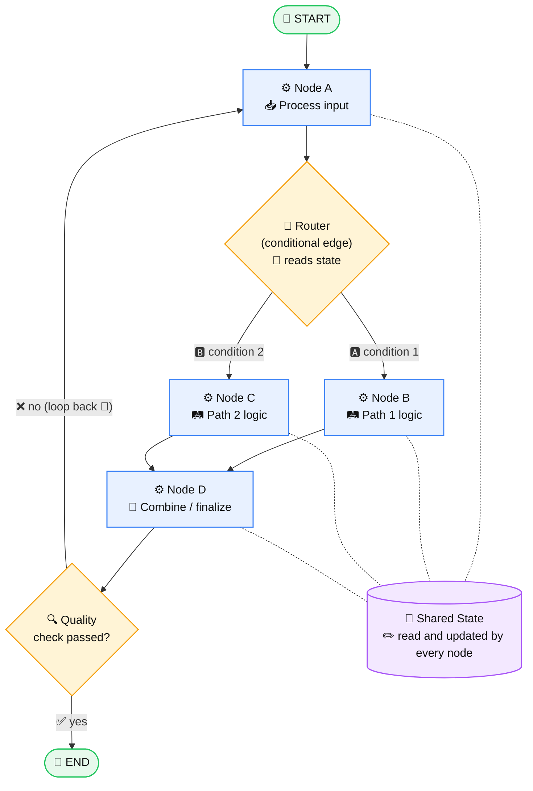

# 🔀 01 · Workflow

## 🧭 What is a Workflow?

In LangGraph, a **workflow** is a **graph of predefined steps** 🗺️ that transforms a shared state from input to output. The developer decides the possible paths in code 👨‍💻; the LLM 🤖 (if used) only does work *inside* a step, not decide the overall structure.

> 🚂 **Workflow** = predetermined control flow (a train on fixed tracks).
> 🚗 **Agent** = the LLM decides the control flow at runtime (a car with a driver).

✅ Use a workflow when the steps are known in advance and you want **predictability, debuggability, and control**.

---

## 🧱 Core Building Blocks

| Icon | Concept | Role |
|---|---|---|
| 🎒 | **State** | A shared data object (`TypedDict` or Pydantic model) that flows through the graph. Every node reads from it and writes updates back. |
| ⚙️ | **Node** | A Python function: `state -> partial state update`. Does one unit of work (LLM call 🤖, tool call 🔧, parsing 📝, validation ✅). |
| ➡️ | **Edge** | A fixed connection: "after node A, always run node B". |
| 🔱 | **Conditional Edge** | A routing function that inspects the state and returns the next node's name. This is how branching and loops are expressed. |
| 🚦 | **START / END** | Special entry and exit points of the graph. |

### 🎯 State routing in one sentence
Nodes don't call each other 🙅. They **update the state** 🎒, and **edges decide where the state goes next** 🧭.

---

## 🗺️ High-Level Workflow Diagram



**📖 How to read it:**
- 🎒 The state travels along the arrows.
- 🔶 Diamonds are conditional edges (routing decisions based on state).
- 〰️ Dotted lines show every node operates on the same shared state.
- 🔁 The loop back to Node A shows workflows can contain cycles while staying fully predefined.

---

## 💻 Minimal Code Skeleton

```python
from typing import TypedDict
from langgraph.graph import StateGraph, START, END

# 🎒 1. State
class State(TypedDict):
    input: str
    result: str

# ⚙️ 2. Nodes
def node_a(state: State) -> dict:
    return {"result": state["input"].strip()}

def node_b(state: State) -> dict:
    return {"result": state["result"] + " -> path 1"}

def node_c(state: State) -> dict:
    return {"result": state["result"] + " -> path 2"}

# 🔱 3. Router (conditional edge function)
def route(state: State) -> str:
    return "node_b" if len(state["result"]) > 10 else "node_c"

# 🔌 4. Wire the graph
builder = StateGraph(State)
builder.add_node("node_a", node_a)
builder.add_node("node_b", node_b)
builder.add_node("node_c", node_c)

builder.add_edge(START, "node_a")
builder.add_conditional_edges("node_a", route, ["node_b", "node_c"])
builder.add_edge("node_b", END)
builder.add_edge("node_c", END)

# 🚀 5. Compile and run
graph = builder.compile()
graph.invoke({"input": "  hello workflow  "})
```

---

## 🏆 Key Takeaways

- 📦 A workflow is a **compiled graph** (`StateGraph(...).compile()`) that you `invoke` with an initial state.
- ⚙️ Nodes **do the work** · ➡️ edges **do the routing** · 🎒 state is **the only communication channel**.
- 🔱 Branching = conditional edges. 🔁 Repetition = edges pointing back to an earlier node.
- 🎛️ Control flow is **defined by you**, making workflows more predictable and testable 🧪 than fully autonomous agents.