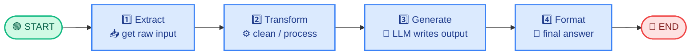

<!-- Remix Icon CDN (renders in viewers that allow external CSS; emojis are the fallback) -->
<link href="https://cdn.jsdelivr.net/npm/remixicon@4.3.0/fonts/remixicon.css" rel="stylesheet">

# <i class="ri-arrow-right-line"></i> 02 · Sequential Workflow ➡️

> **One-liner:** tasks run **one after another, in a fixed order**. Step B never starts before Step A finishes. 🚦

---

## <i class="ri-lightbulb-line"></i> 💡 Core Idea

A **Sequential Workflow** is the simplest LangGraph pattern: a straight line of nodes connected by plain edges.

- <i class="ri-node-tree"></i> **Nodes** = Python functions that read the `State` and return updates.
- <i class="ri-links-line"></i> **Edges** = fixed connections (`add_edge`). No branching, no loops.
- <i class="ri-database-2-line"></i> **State** = the "baton" 🏃 passed along; each node adds its piece.

```
START ➜ Node 1 ➜ Node 2 ➜ Node 3 ➜ END
```

Think of it as an **assembly line** 🏭: every station does one job, then passes the product forward.

---

## <i class="ri-flow-chart"></i> 🗺️ Diagram: Linear Execution Path



🔎 **Read it left → right:** each box runs exactly once, in order, and hands the updated `State` to the next one.

---

## <i class="ri-settings-3-line"></i> ⚙️ How It Works (Step by Step)

| # | What happens | Icon |
|---|---|---|
| 1 | You call `graph.invoke(initial_state)` | <i class="ri-play-circle-line"></i> ▶️ |
| 2 | LangGraph enters the first node after `START` | <i class="ri-login-box-line"></i> 🚪 |
| 3 | The node runs and returns a **partial update** (e.g. `{"cleaned": "..."}`) | <i class="ri-function-line"></i> 🧩 |
| 4 | LangGraph **merges** that update into the shared `State` | <i class="ri-merge-cells-horizontal"></i> 🔀 |
| 5 | It follows the single outgoing edge to the next node | <i class="ri-arrow-right-circle-line"></i> ➡️ |
| 6 | Repeat until `END`, then the **final state** is returned | <i class="ri-flag-line"></i> 🏁 |

### 🔬 State Trace (what the baton looks like at each stop)

| After node | `text` | `cleaned` | `summary` |
|---|---|---|---|
| *(start)* | – | – | – |
| `extract` | `"  LangGraph makes agents easy!  "` | – | – |
| `transform` | same | `"langgraph makes agents easy!"` | – |
| `generate` | same | same | `"Summary: langgraph makes agents easy!"` |

> 💡 Nodes return **only the keys they change**. LangGraph keeps the rest untouched.

---

## <i class="ri-code-s-slash-line"></i> 🧑‍💻 Minimal Code

```python
from typing import TypedDict
from langgraph.graph import StateGraph, START, END

# 📦 Shared state
class State(TypedDict):
    text: str
    cleaned: str
    summary: str

# 🧩 Nodes (each returns a partial state update)
def extract(state: State):
    return {"text": "  LangGraph makes agents easy!  "}

def transform(state: State):
    return {"cleaned": state["text"].strip().lower()}

def generate(state: State):
    return {"summary": f"Summary: {state['cleaned']}"}

# 🏗️ Build the graph
builder = StateGraph(State)
builder.add_node("extract", extract)
builder.add_node("transform", transform)
builder.add_node("generate", generate)

# 🔗 Fixed, linear edges
builder.add_edge(START, "extract")
builder.add_edge("extract", "transform")
builder.add_edge("transform", "generate")
builder.add_edge("generate", END)

graph = builder.compile()
print(graph.invoke({}))   # ▶️ run it!
```

> 💎 **Shortcut:** `builder.add_sequence([extract, transform, generate])` adds the nodes and wires them in order for you.

### 📡 Watching it run (streaming)

```python
for step in graph.stream({}, stream_mode="updates"):
    print(step)   # 👀 see each node's update as it finishes
```

---

## <i class="ri-checkbox-circle-line"></i> ✅ When to Use It

| | Situation | Why it fits |
|---|---|---|
| <i class="ri-list-ordered"></i> 📋 | Steps have **strict dependencies** (B needs A's output) | Order is guaranteed |
| <i class="ri-eye-line"></i> 🔍 | You want a **predictable, easy-to-debug** flow | One path = easy tracing |
| <i class="ri-flashlight-line"></i> ⚡ | A **fixed pipeline** with no decisions | No routing logic needed |
| <i class="ri-file-text-line"></i> 🧾 | Classic pipelines: **ETL**, prompt chaining, draft → refine → format | Natural step-by-step fit |

### 🧪 Real-world examples

- 📝 **Content pipeline:** research → outline → draft → proofread
- 📄 **Document processing:** load → chunk → embed → store
- 🧾 **Report generation:** fetch data → analyze → write summary → format as PDF
- 🔗 **Prompt chaining:** LLM call 1 output feeds LLM call 2

## <i class="ri-close-circle-line"></i> ❌ When NOT to Use It

- <i class="ri-git-branch-line"></i> 🔀 You need **decisions / branching** → use *Conditional Routing*.
- <i class="ri-repeat-line"></i> 🔁 You need **retries or loops** → use a *Cyclic Graph*.
- <i class="ri-team-line"></i> ⚡ Tasks are **independent** and could run together → use *Parallel Workflow*.

---

## <i class="ri-scales-3-line"></i> ⚖️ Pros & Cons

| 👍 Pros | 👎 Cons |
|---|---|
| Simple to build and reason about | No branching or decisions |
| Deterministic: same path every run | One slow step delays everything |
| Easy to test each node in isolation | Independent tasks can't run in parallel |
| Clear logs and traces | A failure stops the rest of the line |

---

## <i class="ri-error-warning-line"></i> ⚠️ Common Pitfalls

1. 🔑 **Key mismatch:** a node reads `state["cleaned"]` before any earlier node has set it → `KeyError`. Check that the order matches the data dependencies.
2. 🔗 **Missing edge:** forgetting `START → first` or `last → END` leaves the graph incomplete.
3. 📦 **Returning the whole state:** return only the changed keys, not a copy of everything.
4. 🧱 **Overstuffed nodes:** one giant node defeats the purpose. Keep each node to **one clear job** so you can trace, test, and retry it.
5. 🔁 **Using it for decisions:** if you find yourself writing `if/else` between nodes, switch to conditional edges.

---

## <i class="ri-star-line"></i> 🧠 Key Takeaways

1. 📏 **Strict order:** deterministic, one path only.
2. 🔗 Built with plain `add_edge` calls from `START` to `END`.
3. 📦 Nodes communicate only through the shared **State**.
4. 🧩 Each node returns a **partial update** that LangGraph merges in.
5. 🚀 Best for simple, predictable pipelines. Start here, add complexity later.

---

⬅️ **Previous:** `01_basics.md` &nbsp;|&nbsp; ➡️ **Next:** `03_parallel_workflow.md`