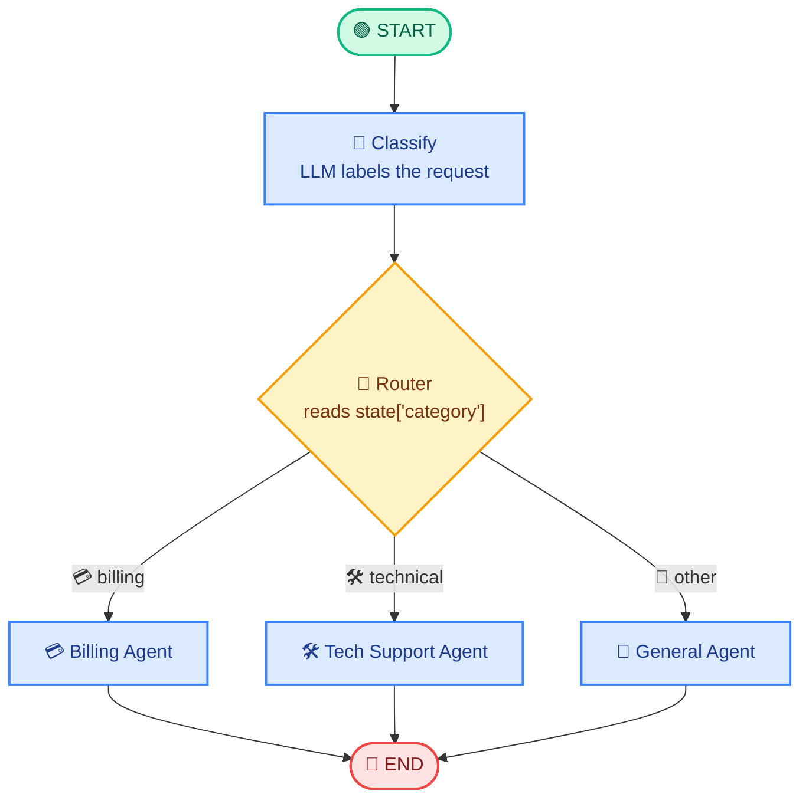

<!-- Remix Icon CDN (renders in viewers that allow external CSS; emojis are the fallback) -->
<link href="https://cdn.jsdelivr.net/npm/remixicon@4.3.0/fonts/remixicon.css" rel="stylesheet">

# <i class="ri-git-branch-line"></i> 03 · Conditional Workflow 🔀

> **One-liner:** the graph **looks at the current state and decides which path to take next**. 🧭

---

## <i class="ri-lightbulb-line"></i> 💡 Core Idea

A sequential workflow always walks the same road. A **Conditional Workflow** adds a fork in that road. After a node finishes, LangGraph calls a small **routing function** that inspects the shared `State` and returns the name of the next node. Because that decision is made at runtime, two different inputs can travel through two completely different parts of the graph.

The decision can be plain Python logic (for example, "is the score above 0.8?") or it can come from an **LLM's output** (for example, a classifier node that labels a user message as `billing`, `technical`, or `general`). Either way, the pattern is the same: one node produces information, a router reads it, and the graph branches. 🌿

In LangGraph this is done with `add_conditional_edges`, which replaces the fixed `add_edge` for that one step. Everything else (nodes, state, `START`, `END`) works exactly as before.

---

## <i class="ri-flow-chart"></i> 🗺️ Diagram: Decision Node Routing



🔎 **Read it top → bottom:** the yellow diamond is the decision point. Only **one** of the three branches runs for any given request, and all branches finish at `END`.

---

## <i class="ri-settings-3-line"></i> ⚙️ How It Works

When `graph.invoke(...)` runs, LangGraph executes the first node and merges its output into the state, just like in a sequential workflow. At the conditional step, instead of following a fixed edge, it calls your **routing function** with the current state. That function does not change the state; its only job is to return a label.

LangGraph then uses that label to pick the next node. You can return the node name directly, or return a short label and give `add_conditional_edges` a **path map** that translates labels into node names. The chosen node runs, and the flow continues from there until `END`. Branches that were not chosen are simply skipped. ⏭️

A helpful way to remember it: **nodes do the work, the router only chooses the road.** 🛣️

---

## <i class="ri-code-s-slash-line"></i> 🧑‍💻 Minimal Code

```python
from typing import TypedDict, Literal
from langgraph.graph import StateGraph, START, END

# 📦 Shared state
class State(TypedDict):
    question: str
    category: str
    answer: str

# 🧠 Node that produces the information the router needs
def classify(state: State):
    q = state["question"].lower()
    if "invoice" in q or "refund" in q:
        return {"category": "billing"}
    if "error" in q or "crash" in q:
        return {"category": "technical"}
    return {"category": "general"}

# 🔀 Router: reads state, returns the next node's name (changes nothing)
def route(state: State) -> Literal["billing", "technical", "general"]:
    return state["category"]

# 🧩 Branch nodes
def billing(state: State):
    return {"answer": "💳 Routing you to billing support."}

def technical(state: State):
    return {"answer": "🛠️ Let's debug that error together."}

def general(state: State):
    return {"answer": "💬 Happy to help with general questions."}

# 🏗️ Build the graph
builder = StateGraph(State)
builder.add_node("classify", classify)
builder.add_node("billing", billing)
builder.add_node("technical", technical)
builder.add_node("general", general)

builder.add_edge(START, "classify")

# 🌿 The fork: one conditional edge instead of a fixed edge
builder.add_conditional_edges(
    "classify",   # after this node...
    route,        # ...call this router...
    {             # ...and map its label to a node
        "billing": "billing",
        "technical": "technical",
        "general": "general",
    },
)

# 🏁 Every branch ends the run
builder.add_edge("billing", END)
builder.add_edge("technical", END)
builder.add_edge("general", END)

graph = builder.compile()
print(graph.invoke({"question": "I need a refund for my invoice"}))
```

> 💎 **LLM-driven routing:** replace the keyword logic in `classify` with an LLM call (ideally with structured output) that returns one of the allowed labels. The router and edges stay exactly the same. 🤖

---

## <i class="ri-checkbox-circle-line"></i> ✅ When to Use It

Use a conditional workflow whenever **the next step depends on something you only know at runtime**. Typical cases are intent classification and routing to specialist agents, validating an output and sending it either forward or to a fix-up step, and choosing a tool or model based on the task. It is also the building block for loops: if a router can send the flow *back* to an earlier node, you get retries and refinement cycles. 🔁

It fits best when the set of possible paths is small and known in advance, so you can describe each branch clearly and test it separately. 🧪

## <i class="ri-close-circle-line"></i> ❌ When NOT to Use It

If every run follows the same steps in the same order, the extra routing adds complexity for no benefit, so stick with a **Sequential Workflow**. If the branches are independent and should all run at the same time rather than choosing one, use a **Parallel Workflow**. And if the next step is open-ended and the model should pick from many tools freely, an **agent loop** is a better fit than a hand-built fork. 🤖

---

## <i class="ri-scales-3-line"></i> ⚖️ Pros & Cons

The big advantage is **flexibility with control**. You get dynamic behavior, but the possible paths are still explicit in the graph, so the system stays easy to visualize, debug, and test. Each branch can be developed and improved on its own. 👍

The trade-off is that complexity grows with every branch. An LLM-based router can also misclassify, which sends the request down the wrong path, so routing quality directly affects overall quality. 👎

---

## <i class="ri-error-warning-line"></i> ⚠️ Common Pitfalls

The most common mistake is a **router that returns a label with no matching node**, which raises an error at runtime. Use `Literal[...]` type hints and a path map so mistakes show up early. 🏷️

Another is putting **state changes inside the router**. Routers should only read state and return a label; do the updating in a node. ✍️

Finally, remember to **give every branch a way to finish**. A branch with no outgoing edge to `END` (or to another node) leaves the graph incomplete. Also add a sensible **default branch** (such as `general` above) so unexpected input never has nowhere to go. 🛟

---

## <i class="ri-star-line"></i> 🧠 Key Takeaways

1. 🔀 `add_conditional_edges` lets the graph **choose its next node at runtime**.
2. 🧭 A **router function** reads the state and returns a label; it never edits the state.
3. 🤖 The decision can come from simple Python logic or from an **LLM's output**.
4. 🌿 Only the **chosen branch** runs; the others are skipped.
5. 🔁 Routing back to an earlier node is how you build **loops and retries** later.

---

⬅️ **Previous:** `02_sequential_workflow.md` &nbsp;|&nbsp; ➡️ **Next:** `04_parallel_workflow.md`