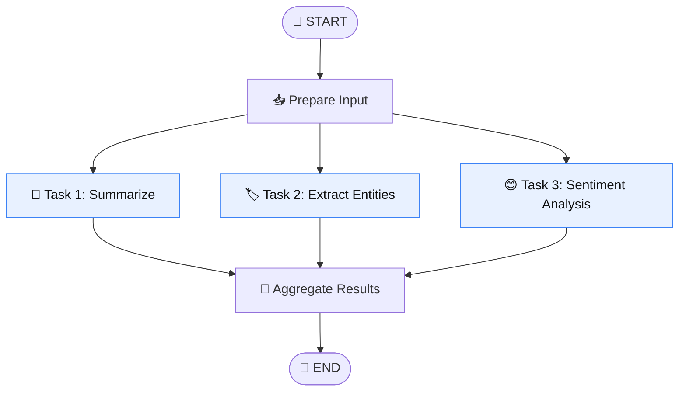

<!-- Remix Icon stylesheet (renders <i class="ri-..."> icons in viewers that allow HTML/CSS) -->
<link href="https://cdn.jsdelivr.net/npm/remixicon@4.2.0/fonts/remixicon.css" rel="stylesheet">

# <i class="ri-git-branch-line"></i> 04 · Parallel Workflow ⚡

## <i class="ri-lightbulb-line"></i> Core Idea 💡

A **parallel workflow** runs multiple independent nodes at the same time, then **converges** their results in a single downstream node. This is the **fan-out / fan-in** pattern:

- <i class="ri-git-branch-line"></i> 🌱 **Fan-out:** one node has several outgoing edges, so all target nodes start together.
- <i class="ri-git-merge-line"></i> 🧩 **Fan-in:** the parallel branches all point to one node, which collects their outputs and continues.

In LangGraph, parallelism comes from graph structure alone. No threads or `asyncio.gather` are needed. Nodes that can run together are scheduled in the same **superstep** 🪜, and the graph moves on only once every node in that superstep has finished.

## <i class="ri-flow-chart"></i> Diagram 🗺️



🌱 `Prepare Input` **fans out** into three concurrent tasks, and 🧩 `Aggregate Results` **fans them back in**.

## <i class="ri-timer-flash-line"></i> Why It Improves Efficiency ⏱️

If three tasks are independent (none needs another's output), running them sequentially wastes time:

| Execution | Total latency |
|---|---|
| 🐢 Sequential | `t1 + t2 + t3` |
| 🐇 Parallel | `max(t1, t2, t3)` |

This matters most for I/O-bound work such as <i class="ri-robot-line"></i> LLM calls, <i class="ri-links-line"></i> API requests, and <i class="ri-database-2-line"></i> database or vector-store lookups, where most of the time is spent waiting. The only requirement is that the branches are truly independent.

## <i class="ri-code-s-slash-line"></i> Minimal Example 🧪

```python
import operator
from typing import Annotated, TypedDict
from langgraph.graph import StateGraph, START, END


class State(TypedDict):
    text: str
    # Reducer: merges concurrent writes instead of overwriting them
    results: Annotated[list[str], operator.add]


def prepare(state: State):
    return {}  # e.g., clean or validate input


def summarize(state: State):
    return {"results": ["summary: ..."]}


def extract_entities(state: State):
    return {"results": ["entities: ..."]}


def sentiment(state: State):
    return {"results": ["sentiment: ..."]}


def aggregate(state: State):
    return {"results": [f"combined {len(state['results'])} outputs"]}


builder = StateGraph(State)
builder.add_node("prepare", prepare)
builder.add_node("summarize", summarize)
builder.add_node("extract_entities", extract_entities)
builder.add_node("sentiment", sentiment)
builder.add_node("aggregate", aggregate)

builder.add_edge(START, "prepare")

# 🌱 Fan-out: one source, multiple targets
builder.add_edge("prepare", "summarize")
builder.add_edge("prepare", "extract_entities")
builder.add_edge("prepare", "sentiment")

# 🧩 Fan-in: wait for ALL branches before aggregating
builder.add_edge(["summarize", "extract_entities", "sentiment"], "aggregate")

builder.add_edge("aggregate", END)

graph = builder.compile()
print(graph.invoke({"text": "LangGraph is great.", "results": []}))
```

## <i class="ri-key-line"></i> Key Points 🔑

1. <i class="ri-stack-line"></i> 📚 **Use a reducer on shared keys.** When parallel nodes write to the same state key, LangGraph needs a reducer such as `Annotated[list, operator.add]`. Without one, you get an `InvalidUpdateError`. Giving each branch its own key avoids the issue.
2. <i class="ri-hourglass-line"></i> ⏳ **Fan-in with a list waits for all branches.** `add_edge([a, b, c], "join")` runs `join` only after every listed node completes. Separate `add_edge` calls from each branch would instead trigger `join` as each branch finishes.
3. <i class="ri-link-unlink"></i> 🔓 **Branches must be independent.** If one task needs another's output, put it in a later superstep (a sequential edge).
4. <i class="ri-node-tree"></i> 🌳 **Dynamic fan-out uses `Send`.** When the number of branches is only known at runtime (e.g., one task per document), use the `Send` API in a conditional edge. This is the map-reduce pattern.
5. <i class="ri-error-warning-line"></i> ⚠️ **Failures affect the whole superstep.** If one parallel node raises an error, the superstep fails. Add retries or error handling inside nodes when partial results are acceptable.

## <i class="ri-checkbox-circle-line"></i> When to Use ✅

- <i class="ri-robot-line"></i> 🤖 Running several independent LLM calls on the same input
- <i class="ri-search-line"></i> 🔍 Querying multiple data sources or tools at once
- <i class="ri-medal-line"></i> 🏆 Generating multiple candidate answers and merging or ranking them
- <i class="ri-git-branch-line"></i> 🌿 Any step where branches don't depend on each other