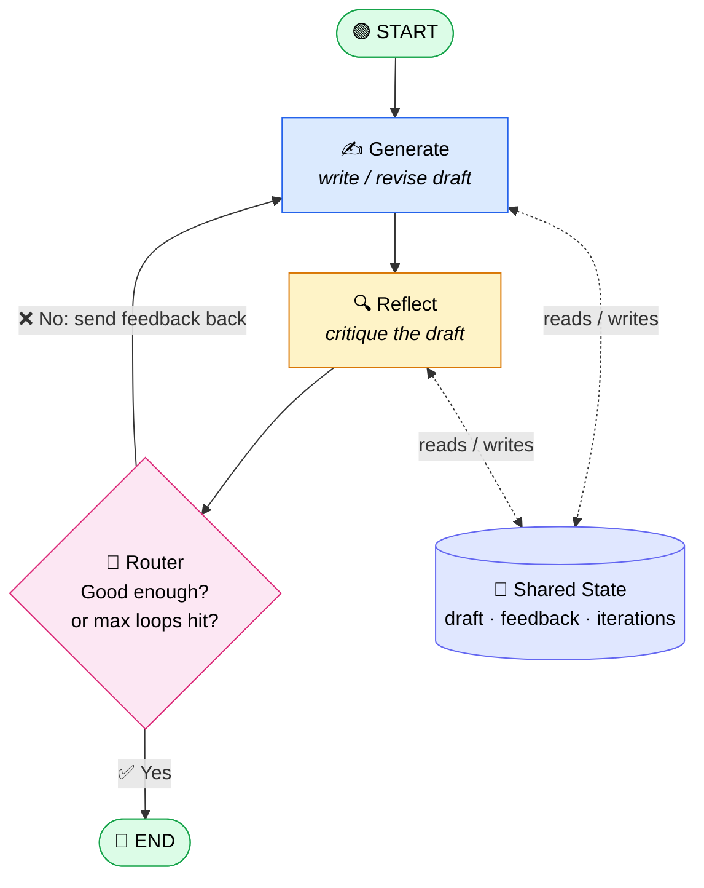

<!-- Optional: enable Remix Icons when rendering this file as HTML -->
<!-- <link href="https://cdn.jsdelivr.net/npm/remixicon@4.2.0/fonts/remixicon.css" rel="stylesheet"> -->

# <i class="ri-loop-left-line"></i> 🔁 04 · Iterative Workflow (Loops & Cycles)

> **TL;DR:** An iterative workflow lets a graph **go back to an earlier node** until a condition is met, so an agent can *try → check → improve → repeat* instead of running once and hoping for the best.

---

## <i class="ri-lightbulb-flash-line"></i> 💡 What Is It?

In the previous chapters, the graph moved **forward only**:

```
START → A → B → C → END        (a straight line, a "DAG")
```

An **iterative workflow** adds a **cycle**: a *conditional edge* can route execution **back** to a previous node.

```
START → Generate → Reflect ──(not good enough)──┐
            ▲                                    │
            └────────────────────────────────────┘
                        │
                  (good enough) → END
```

Three ingredients make a loop work:

| | Ingredient | Role |
|---|---|---|
| <i class="ri-database-2-line"></i> 🧠 | **State** | Remembers the draft, feedback, and iteration count between passes |
| <i class="ri-git-branch-line"></i> 🔀 | **Conditional edge** | A router function that decides: *loop again* or *finish* |
| <i class="ri-stop-circle-line"></i> 🛑 | **Exit condition** | Quality threshold **and** a hard iteration cap (safety net) |

---

## <i class="ri-flow-chart"></i> 🗺️ The Architecture



The arrow `Router → Generate` is the **cycle**. Everything else is a normal graph.

---

## <i class="ri-robot-2-line"></i> 🤖 Why This Is Crucial for Agentic Behavior

A single LLM call is a **one-shot guess**. An *agent* is something that **pursues a goal**, and pursuing a goal means noticing when you've missed and trying again.

| <i class="ri-star-line"></i> Capability | 🧩 How loops enable it |
|---|---|
| 🪞 **Self-reflection** | The agent critiques its own output and fixes it |
| 🛠️ **Tool use / ReAct** | *Think → Act → Observe → Think…* is literally a loop |
| 🩹 **Error recovery** | A failed tool call or failing test triggers a retry |
| 🎯 **Goal-directed behavior** | Keeps working until the objective is *verified*, not just attempted |
| 📈 **Quality control** | Output improves with each pass (draft → polished) |

> 🧠 **Mental model:** a straight line is a *script*; a loop is *judgment*.

---

## <i class="ri-code-s-slash-line"></i> 🧪 Minimal Implementation

```python
from typing import TypedDict, Literal
from langgraph.graph import StateGraph, START, END

MAX_ITERATIONS = 3

# 🧠 1. State: what persists across loop iterations
class State(TypedDict):
    topic: str
    draft: str
    feedback: str
    approved: bool
    iterations: int

# ✍️ 2. Generate node: write or revise
def generate(state: State) -> dict:
    prompt = f"Write a short paragraph about: {state['topic']}"
    if state.get("feedback"):
        prompt += f"\nRevise using this feedback: {state['feedback']}\nPrevious draft: {state['draft']}"
    draft = llm.invoke(prompt).content
    return {"draft": draft, "iterations": state.get("iterations", 0) + 1}

# 🔍 3. Reflect node: critique and decide
def reflect(state: State) -> dict:
    review = llm.invoke(
        f"Critique this draft. Reply 'APPROVED' if it is excellent, "
        f"otherwise give concrete feedback:\n\n{state['draft']}"
    ).content
    return {"approved": review.strip().startswith("APPROVED"), "feedback": review}

# 🔀 4. Router: the conditional edge that creates the cycle
def should_continue(state: State) -> Literal["generate", "__end__"]:
    if state["approved"] or state["iterations"] >= MAX_ITERATIONS:  # 🛑 always cap!
        return END
    return "generate"                                               # 🔁 loop back

# 🏗️ 5. Wire the graph
builder = StateGraph(State)
builder.add_node("generate", generate)
builder.add_node("reflect", reflect)

builder.add_edge(START, "generate")
builder.add_edge("generate", "reflect")
builder.add_conditional_edges("reflect", should_continue)  # ⬅️ the loop lives here

graph = builder.compile()

result = graph.invoke({"topic": "Why cycles matter in agents", "iterations": 0})
print(result["draft"])
```

---

## <i class="ri-key-2-line"></i> 🔑 Key Takeaways

1. <i class="ri-arrow-go-back-line"></i> **A cycle = a conditional edge pointing to an earlier node.** No special "loop" keyword is needed.
2. <i class="ri-database-line"></i> **State is the loop's memory.** Without it, each pass starts from scratch.
3. <i class="ri-shield-check-line"></i> **Always add a hard stop.** Pair the quality check with `iterations >= MAX`, or a stubborn condition will loop (and bill you) forever.
4. <i class="ri-alert-line"></i> **LangGraph enforces a `recursion_limit`** (default 25 steps) as a backstop. Raise it deliberately with `graph.invoke(inputs, config={"recursion_limit": 50})`.
5. <i class="ri-user-star-line"></i> **Make the critic specific.** Vague feedback produces vague revisions; ask for concrete, actionable critique.

---

## <i class="ri-road-map-line"></i> ➡️ What's Next?

Loops get even more powerful when combined with **tools** (ReAct agents) and **human-in-the-loop** checkpoints ⏸️, where the cycle pauses for a person to approve or steer before continuing.