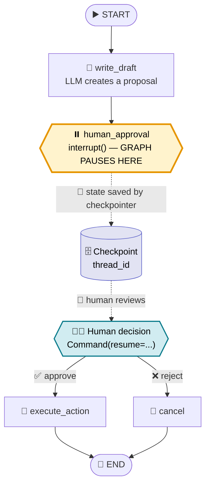

<!-- Optional: to render Remix Icons (<i class="ri-...">) add this to your docs site/HTML head:
<link href="https://cdn.jsdelivr.net/npm/remixicon@4.2.0/fonts/remixicon.css" rel="stylesheet"> -->

# <i class="ri-user-voice-line"></i> 🙋 Human-in-the-Loop (HITL) Workflow

> <i class="ri-lightbulb-flash-line"></i> 💡 **One-liner:** A HITL workflow lets a LangGraph run **pause** at a chosen point, **wait** for a human to review/approve/edit, then **resume** exactly where it stopped.

---

## <i class="ri-question-line"></i> ❓ Why use it?

Agents can call tools, spend money, send emails, or write to databases. For risky or ambiguous steps, you want a human to say **"yes, go ahead"** (or **"no, change this"**) before the graph continues.

| Use case | Example |
|---|---|
| <i class="ri-shield-check-line"></i> ✅ Approval | "Send this refund of $500?" |
| <i class="ri-edit-2-line"></i> ✏️ Edit | Human fixes an LLM-written draft |
| <i class="ri-question-answer-line"></i> 💬 Clarify | Agent asks the user a missing detail |

---

## <i class="ri-git-branch-line"></i> 🗺️ The Flow



> <i class="ri-pause-circle-line"></i> ⏸️ The **yellow node** is the interrupt point. Everything before it runs automatically; everything after waits for the human.

---

## <i class="ri-settings-3-line"></i> ⚙️ Core Mechanics (3 steps)

### 1️⃣ <i class="ri-pause-circle-line"></i> Pause: `interrupt()`
Calling `interrupt(payload)` inside a node **stops execution** and surfaces `payload` to the caller (e.g., "Approve this refund?").

### 2️⃣ <i class="ri-save-3-line"></i> Persist: Checkpointer + `thread_id`
LangGraph saves the full state to a **checkpointer**. The `thread_id` is the "bookmark" that identifies *which* paused run to continue.
> ⚠️ **No checkpointer = no HITL.** Pausing requires persistence.

### 3️⃣ <i class="ri-play-circle-line"></i> Resume: `Command(resume=...)`
Invoke the graph again with the **same `thread_id`** and `Command(resume=value)`. That `value` becomes the **return value of `interrupt()`**, and the graph continues.

---

## <i class="ri-code-s-slash-line"></i> 🧪 Minimal Example

```python
from typing import TypedDict
from langgraph.graph import StateGraph, START, END
from langgraph.checkpoint.memory import MemorySaver
from langgraph.types import interrupt, Command

class State(TypedDict):
    draft: str
    approved: bool

def write_draft(state: State):
    return {"draft": "Refund $500 to customer #42"}

def human_approval(state: State):
    # ⏸️ PAUSE: execution stops here and waits for a human
    decision = interrupt({
        "question": "Approve this action?",
        "draft": state["draft"],
    })
    # ▶️ RESUME: `decision` is whatever the human sent back
    return {"approved": decision == "approve"}

def execute_action(state: State):
    print(f"🚀 Executing: {state['draft']}")
    return {}

def cancel(state: State):
    print("🛑 Cancelled")
    return {}

builder = StateGraph(State)
builder.add_node("write_draft", write_draft)
builder.add_node("human_approval", human_approval)
builder.add_node("execute_action", execute_action)
builder.add_node("cancel", cancel)

builder.add_edge(START, "write_draft")
builder.add_edge("write_draft", "human_approval")
builder.add_conditional_edges(
    "human_approval",
    lambda s: "execute_action" if s["approved"] else "cancel",
)
builder.add_edge("execute_action", END)
builder.add_edge("cancel", END)

# 💾 Checkpointer is REQUIRED for pausing/resuming
graph = builder.compile(checkpointer=MemorySaver())

config = {"configurable": {"thread_id": "refund-42"}}  # 🔖 the bookmark

# 1️⃣ Run until the interrupt
result = graph.invoke({"draft": "", "approved": False}, config)
print(result["__interrupt__"])   # 👀 payload shown to the human

# 2️⃣ Human decides → resume with the SAME thread_id
graph.invoke(Command(resume="approve"), config)   # ✅ or "reject" ❌
```

---

## <i class="ri-alert-line"></i> ⚠️ Gotchas

- 🔁 **The interrupted node re-runs from its start on resume.** Keep side effects (API calls, writes) *after* `interrupt()` or make them idempotent.
- 🔖 **Same `thread_id` every time**, or LangGraph starts a fresh run instead of resuming.
- 💾 `MemorySaver` is in-memory only (great for demos). Use a persistent checkpointer (e.g., SQLite/Postgres) in production so pauses survive restarts.
- 📦 The resume value can be anything JSON-serializable: `"approve"`, `{"edited_text": "..."}`, `True`, etc.

---

## <i class="ri-checkbox-circle-line"></i> 🧠 Cheat Sheet

| Step | API | Icon |
|---|---|---|
| Pause & ask | `interrupt(payload)` | ⏸️ |
| Remember state | `checkpointer` + `thread_id` | 💾 |
| Give answer & continue | `Command(resume=value)` | ▶️ |