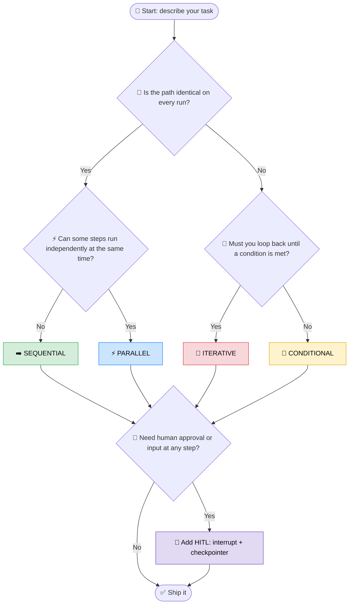

<!-- Optional: to render Remix Icons (<i class="ri-...">) add this to your docs site/HTML head:
<link href="https://cdn.jsdelivr.net/npm/remixicon@4.2.0/fonts/remixicon.css" rel="stylesheet"> -->

# <i class="ri-compass-3-line"></i> 🧭 07 · When to Use What: Choosing a Workflow Pattern

> <i class="ri-lightbulb-flash-line"></i> 💡 **Rule of thumb:** start with the *simplest* pattern that works. Add complexity (branches, loops, parallelism, humans) only when the problem forces you to.

**Icon legend:** each pattern pairs an emoji with its [Remix Icon](https://remixicon.com).

---

## <i class="ri-flashlight-line"></i> ⚡ TL;DR Cheat Sheet

| Pattern | Remix Icon | Choose it when... | LangGraph primitive |
|---|---|---|---|
| ➡️ **Sequential** | <i class="ri-arrow-right-line"></i> | Steps are fixed and each needs the previous output | `add_edge(A, B)` |
| 🔀 **Conditional** | <i class="ri-git-branch-line"></i> | The next step depends on runtime data | `add_conditional_edges(node, router)` |
| ⚡ **Parallel** | <i class="ri-split-cells-horizontal"></i> | Independent tasks can run at the same time | Fan-out edges / `Send` + reducer |
| 🔁 **Iterative** | <i class="ri-loop-left-line"></i> | Repeat until quality or a stop condition is met | Conditional edge pointing *back* |
| 🙋 **HITL** | <i class="ri-user-voice-line"></i> | A human must approve, edit, or supply input | `interrupt()` + checkpointer |

---

## <i class="ri-node-tree"></i> 🌲 Decision Tree

Answer from the top. Patterns **compose**, and HITL is an *overlay* you add to any of the four base patterns.



---

## <i class="ri-arrow-right-line"></i> 1. ➡️ Sequential

**Use when:** the order never changes and each step consumes the previous step's output.

<i class="ri-checkbox-circle-line"></i> **✅ Practical use cases**
- 📝 Draft → Summarize → Translate → Format
- 🧹 ETL: Extract → Clean → Enrich → Load
- 📄 Document pipeline: Parse → Chunk → Embed → Store

<i class="ri-alert-line"></i> **⚠️ Don't use if:** you catch yourself writing `if` statements inside nodes to skip work. That is a Conditional pattern in disguise.

```python
builder.add_edge("extract", "clean")
builder.add_edge("clean", "load")
```

---

## <i class="ri-git-branch-line"></i> 2. 🔀 Conditional

**Use when:** the next node depends on state, an LLM decision, or a validation result.

<i class="ri-checkbox-circle-line"></i> **✅ Practical use cases**
- 🎯 Intent routing: `billing` / `tech_support` / `sales`
- 🛠️ Tool or answer? Agent decides to call a tool or reply directly
- 🛡️ Guardrails: safe → continue, unsafe → refuse
- ❌ Error handling: success → next step, failure → fallback node

<i class="ri-alert-line"></i> **⚠️ Don't use if:** the branch always goes the same way. Use Sequential.

```python
def router(state) -> str:
    return "refund" if state["intent"] == "refund" else "faq"

builder.add_conditional_edges("classify", router, {"refund": "refund", "faq": "faq"})
```

---

## <i class="ri-split-cells-horizontal"></i> 3. ⚡ Parallel

**Use when:** tasks are **independent** and you want lower latency or broader coverage.

<i class="ri-checkbox-circle-line"></i> **✅ Practical use cases**
- 🔎 Multi-source retrieval: web + vector DB + SQL at once
- 🗺️ Map-reduce: summarize N documents in parallel, then merge
- 👥 Multi-reviewer: security, style, and performance reviews of the same code
- 🧪 Compare models: run the same prompt on several LLMs

<i class="ri-alert-line"></i> **⚠️ Gotchas**
- 🧩 Concurrent writes to the same state key need a **reducer** (e.g. `Annotated[list, operator.add]`).
- 🔢 Unknown number of branches at runtime? Use the **`Send` API** (dynamic fan-out).

```python
builder.add_edge(START, "web_search")
builder.add_edge(START, "db_search")
builder.add_edge(["web_search", "db_search"], "merge")  # fan-in
```

---

## <i class="ri-loop-left-line"></i> 4. 🔁 Iterative

**Use when:** the first attempt is rarely good enough and you can **measure** "good enough".

<i class="ri-checkbox-circle-line"></i> **✅ Practical use cases**
- 🪞 Reflection: Generate → Critique → Revise
- 🐛 Code loop: Write → Run tests → Fix → Re-run
- 🤖 ReAct agent: Think → Act → Observe → repeat
- 🔄 Retries with backoff for flaky APIs

<i class="ri-alert-line"></i> **⚠️ Always define an exit.** Use a max-iteration counter in state *and* set `recursion_limit` to avoid infinite loops and runaway cost 💸.

```python
def should_continue(state):
    if state["score"] >= 0.9 or state["iterations"] >= 3:
        return END
    return "revise"

builder.add_conditional_edges("critique", should_continue)
builder.add_edge("revise", "critique")  # the loop back
```

---

## <i class="ri-user-voice-line"></i> 5. 🙋 Human-in-the-Loop (HITL)

**Use when:** an action is **irreversible, costly, regulated, or subjective**, or the agent needs info only a person has.

<i class="ri-checkbox-circle-line"></i> **✅ Practical use cases**
- ✉️ Approve before sending an email or posting publicly
- 💳 Confirm payments, deletions, deployments, DB writes
- ✏️ Review and edit an AI-generated draft
- ❓ Ask the user a clarifying question mid-run

<i class="ri-alert-line"></i> **⚠️ Requirements**
- 💾 A **checkpointer** is mandatory (the graph pauses and resumes later).
- 🧵 Always pass a `thread_id` so the run can be resumed.

```python
from langgraph.types import interrupt, Command

def approval(state):
    decision = interrupt({"question": "Send this email?", "draft": state["draft"]})
    return {"approved": decision == "yes"}

graph = builder.compile(checkpointer=MemorySaver())
graph.invoke(Command(resume="yes"), config={"configurable": {"thread_id": "42"}})
```

---

## <i class="ri-puzzle-line"></i> 🧩 Combining Patterns (Real-World Examples)

| Scenario | Patterns used |
|---|---|
| 🤖 Customer support agent | 🔀 Conditional (intent) → 🔁 Iterative (tool loop) → 🙋 HITL (refund approval) |
| 📚 Research assistant | ⚡ Parallel (multi-source search) → ➡️ Sequential (synthesize) → 🔁 Iterative (critique & refine) |
| 🧑‍💻 Code review bot | ⚡ Parallel (reviewers) → 🔀 Conditional (severity) → 🙋 HITL (merge approval) |

---

## <i class="ri-checkbox-circle-line"></i> ✅ Quick Self-Check

1. ❓ Is every step always executed in the same order? → ➡️ **Sequential**
2. ❓ Are there independent steps that don't need each other's output? → ⚡ **Parallel**
3. ❓ Does the next step depend on data known only at runtime? → 🔀 **Conditional**
4. ❓ Do you need to retry or refine until a condition passes? → 🔁 **Iterative**
5. ❓ Would a wrong action be costly, or does it need human judgment? → 🙋 **HITL**

> <i class="ri-star-line"></i> 💡 **Golden rule:** Prefer **explicit graph structure** over hidden logic inside nodes. If the control flow matters, make it an edge, not an `if`.