# Agentic AI with LangGraph

A complete, hands-on module on building **agentic AI systems** with **LangGraph**, from first principles to working multi-agent workflows. It is part of my [ai-zero-to-hero](https://github.com/Sheharyar-Sarmad/ai-zero-to-hero) repository.

> Diagrams below are written in Mermaid and render natively on GitHub.

---

## Learning Path

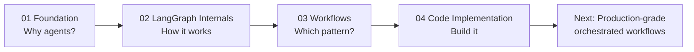

---

## 01 · Foundation

The groundwork before touching any code: prerequisites, the course roadmap, why plain LLM chains are not enough, and what makes a system *agentic*.

### Agentic AI vs Generative AI

| | Generative AI | Agentic AI |
|---|---|---|
| **Goal** | Produce one output for one prompt | Achieve a goal over many steps |
| **Control flow** | Single call, fixed | Dynamic: the system decides what to do next |
| **Tools** | Usually none | Search, APIs, databases, code |
| **Memory** | Only the prompt | Persistent state across steps |
| **Self-correction** | None | Can review, retry, and refine |
| **Example** | "Write a LinkedIn post" | Research, draft, review, rewrite, get human approval |

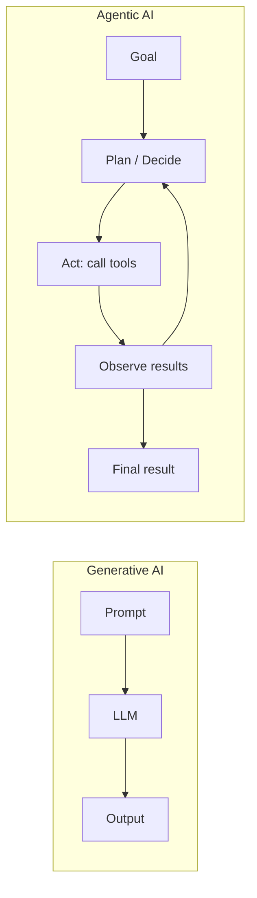

### Why we need LangGraph

Simple chains run in a straight line. Real agents need **loops, branches, parallel steps, shared memory, pauses for humans, and recovery from failures**. LangGraph models all of this as an explicit graph, so behavior is visible, testable, and controllable instead of hidden inside a prompt.

---

## 02 · LangGraph Internals

Everything in LangGraph is built from a few primitives.

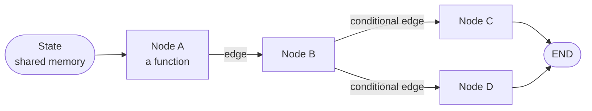

### State
A typed dictionary (`TypedDict`) that every node can read from and write to. It is the single source of truth for the whole run: the topic, messages, drafts, counters, and flags all live here.

### Nodes
Plain Python functions. A node receives the current state and returns **only the keys it wants to update**. Nodes do the work: call an LLM, run a tool, validate output, or aggregate results.

### Edges
Edges decide what runs next.
* **Normal edges:** always go from A to B.
* **Conditional edges:** a router function inspects the state and picks the next node, which enables branching and loops.
* **Fan-out edges:** one node feeds several nodes that run in the same step (parallel).

### Reducers
A reducer defines **how an update is merged into existing state**. Without one, the last write wins. With one, values can accumulate, which is essential when parallel nodes write at the same time.

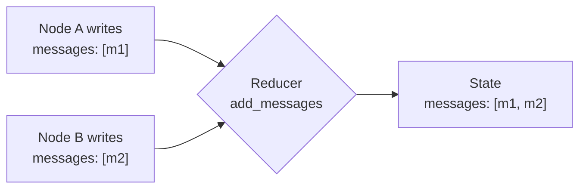

* No reducer: `x = 1` then `x = 2` gives `x = 2` (overwrite).
* `add_messages` reducer: appends and keeps the full conversation.

### Graph compiling
`workflow.compile()` validates the graph (no dangling edges, valid entry point) and turns it into a runnable app. This is also where you attach a **checkpointer**.

### Checkpointing
After every step, LangGraph can save a snapshot of the state under a `thread_id`.

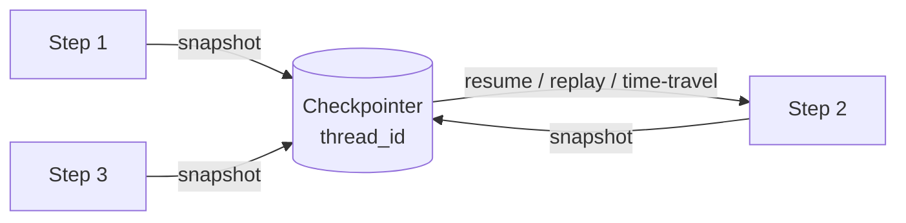

This enables conversation memory, resuming after a crash, replaying a run, and pausing for humans. A new `thread_id` means a fresh, isolated run.

### Interrupts and Human-in-the-Loop (HITL)

* **Interrupt:** a low-level mechanism that pauses the graph at a specific point and hands a payload to the caller.
* **HITL:** a *design pattern* that uses interrupts to put a human in charge of approvals, edits, or decisions.

Interrupts are the tool; HITL is the use case.

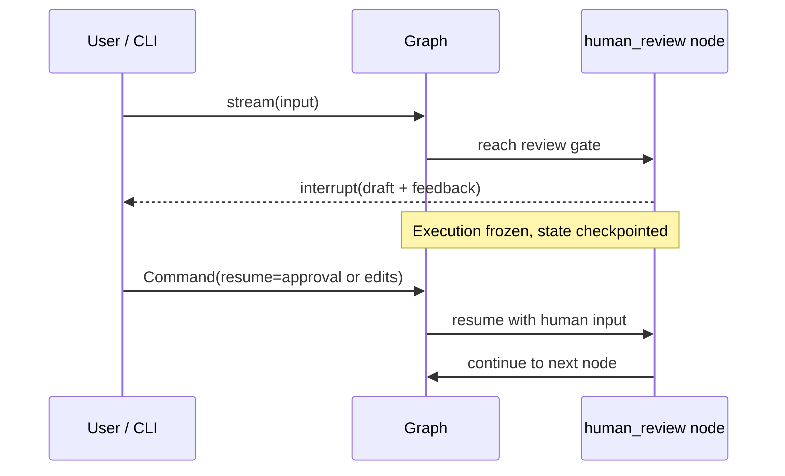

### Streaming
Graphs can stream results while they run, so users see progress instead of waiting.

| Mode | What you get | Best for |
|---|---|---|
| `stream_mode="updates"` | The state update from each node as it finishes | Progress trackers, step logs |
| `stream_mode="messages"` | LLM tokens as they are generated | Chat-style typing effect |
| `stream_mode="values"` | Full state after every step | Debugging, dashboards |

### Subgraphs
A compiled graph can be used as a **node inside another graph**. This encapsulates logic, avoids state pollution, and allows isolated testing.

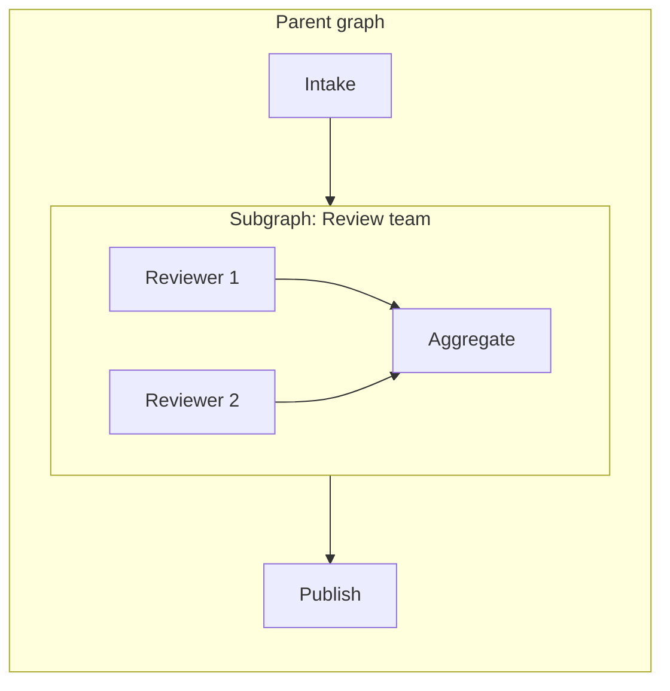

* **Direct node addition:** use when parent and subgraph share state keys.
* **Wrapper function node:** use when schemas differ; map keys in, translate results out.

### Error handling
Production agents must expect failures: rate limits (429s), timeouts, bad tool output, and malformed LLM responses. Defensive patterns include retries with backoff, timeouts, `try/except` inside nodes, hard loop limits, and fallback paths.

### When to use LangGraph, and LangGraph vs `create_agent`

| Use `create_agent` when | Use LangGraph when |
|---|---|
| You need a standard tool-calling agent quickly | You need custom control flow |
| One agent, one loop | Multiple agents, parallel steps, or approvals |
| Little need for custom state | You need explicit, rich state |
| Prototype or simple assistant | Production system needing observability and control |

### Agentic AI system design
Good agent systems are **bounded** (limits on loops, tools, and cost), **observable** (clear state and logs), **governed** (humans where it matters), and **modular** (subgraphs and small nodes).

---

## 03 · Workflows

Five core patterns, plus a guide for choosing between them.

### Sequential
Data moves in a strict line. Each step finishes before the next begins, and one node's output is the next node's input.

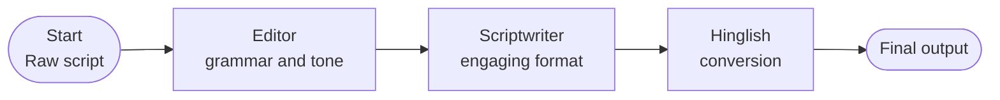

**Use when:** steps depend on each other and order matters. **Trade-off:** simple and predictable, but slow and rigid.

### Conditional
A router inspects the state and sends the flow down one of several paths, which later merge.

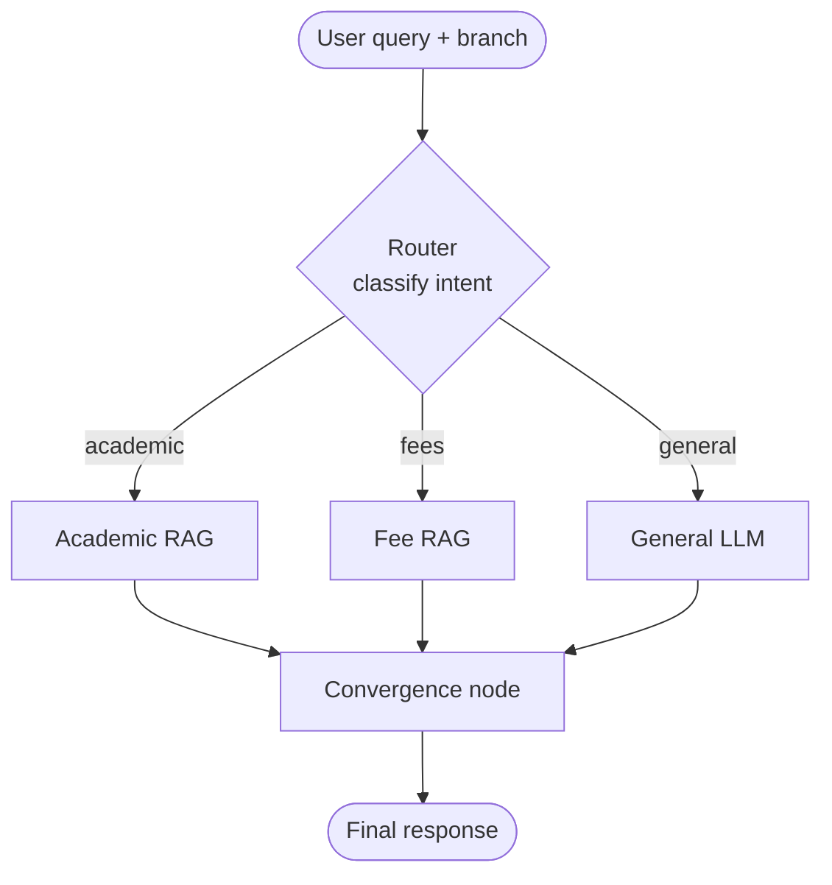

**Use when:** different inputs need different handling. **Trade-off:** more efficient, but routing quality becomes critical.

### Parallel
Independent tasks run at the same time, then results are combined by reducers.

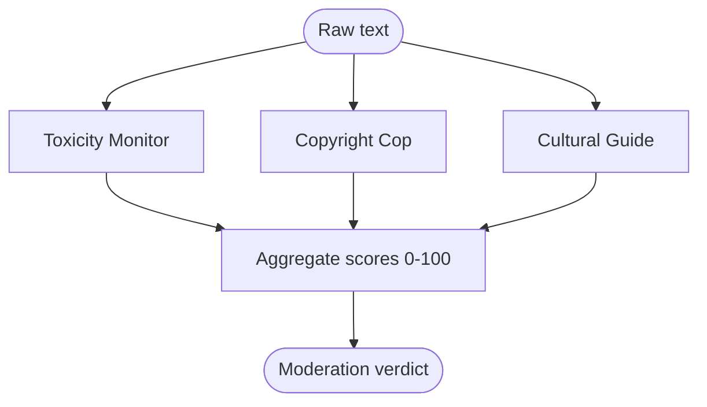

**Use when:** tasks are independent and speed matters. **Trade-off:** faster, but you must design state merging carefully.

### Iterative
A generate, evaluate, improve loop that repeats until a quality bar or a limit is reached.

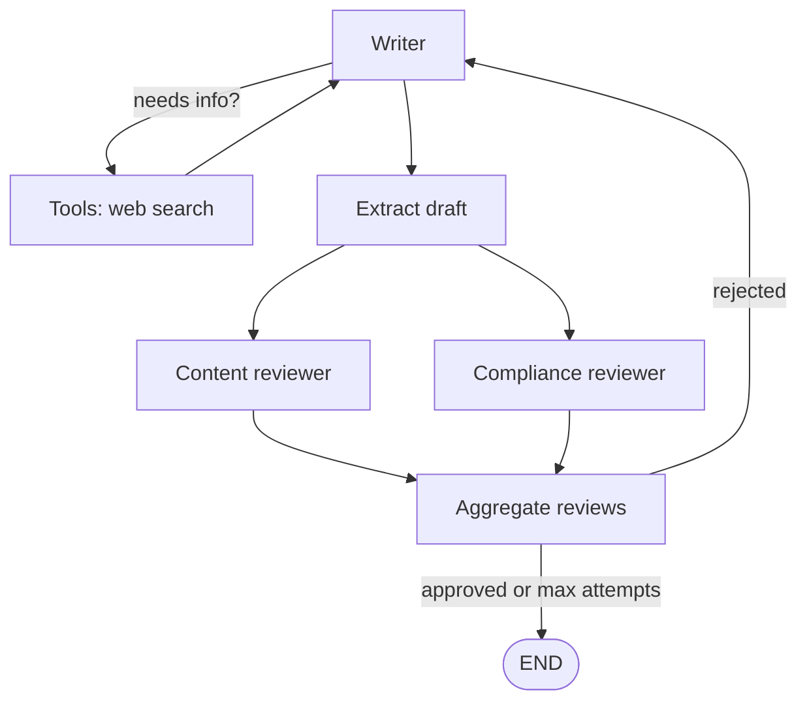

**Use when:** quality can be measured and improved over rounds. **Trade-off:** better output, but higher cost and latency, so it must be bounded.

### Human-in-the-Loop
A human gate pauses the workflow for approval or edits before the system continues.

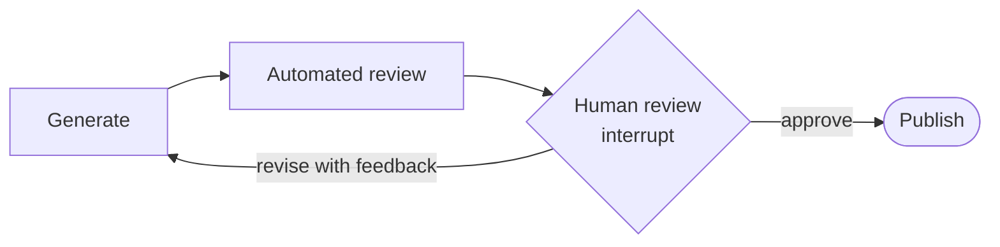

**Use when:** actions are high-stakes, public, or irreversible. **Trade-off:** safest, but depends on human availability.

### When to use what

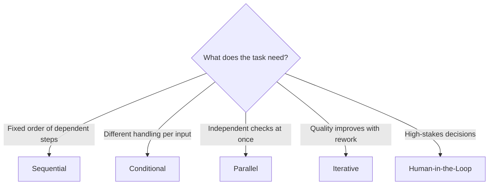

| Pattern | Speed | Cost | Control | Typical use |
|---|---|---|---|---|
| Sequential | Slow | Low | High | Content pipelines |
| Conditional | Fast | Low | Medium | Chatbots, routing, RAG |
| Parallel | Fastest | Medium | Medium | Moderation, multi-perspective analysis |
| Iterative | Slow | High | Medium | Writing, code review, refinement |
| Human-in-the-Loop | Depends on human | Low | Highest | Publishing, approvals |

Real systems **combine** these patterns, as the LinkedIn engine below does.

---

## 04 · Code Implementation

Every concept above is built as working code, using Groq for LLM inference and Streamlit for interactive UIs.

| Project | Pattern(s) | What it demonstrates |
|---|---|---|
| Content pipeline | Sequential | Linear state passing between editor, scriptwriter, and Hinglish nodes |
| Moderation and brand safety | Parallel + reducers | Three concurrent agents scoring text 0-100 and merging results safely |
| College chatbot | Conditional + RAG | Routing to Academic RAG, Fee RAG, or general LLM across BCA, BBA, and B.Com |
| LinkedIn post engine | Iterative + parallel + tools | Tavily search, parallel reviewers, rewrite loop with bounded attempts, rate limiting |
| HITL LinkedIn agent | Human-in-the-loop | `interrupt()` and `Command(resume=...)` for human approval |
| Subgraphs and streaming | Modular + streaming | Nested graphs, token-by-token SSE, and event-by-event updates |

### Featured: LinkedIn Post Engine

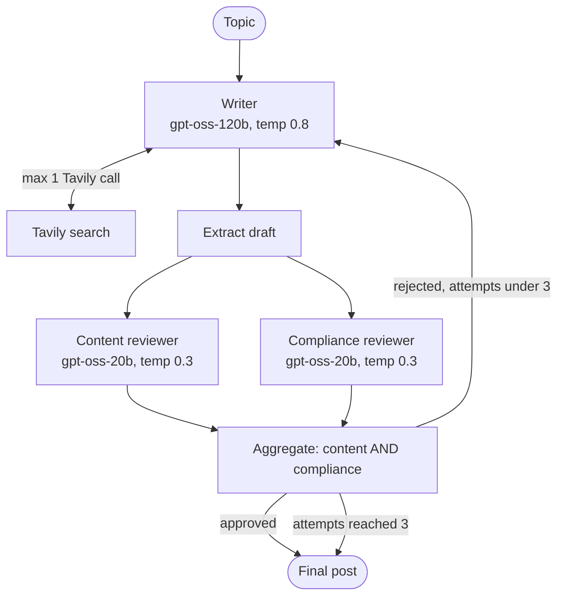

**Safeguards that make it reliable**

* One shared `InMemoryRateLimiter` (about 24 requests per minute) across every Groq call
* `max_retries=3` with backoff and `timeout=60`
* Bounded loops: `MAX_TOOL_CALLS = 1`, `MAX_ATTEMPTS = 3`, `recursion_limit = 25`
* Fresh `thread_id` per topic so old messages never leak into new runs
* Streamlit UI limited to 3 posts per IP per day

### Streaming architecture

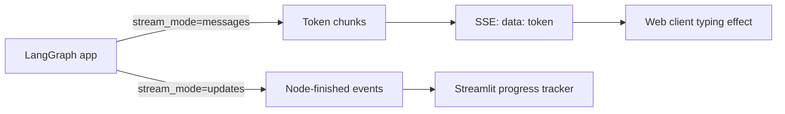

---

## Tech Stack

| Tool | Purpose |
|---|---|
| **LangGraph** | Stateful graph orchestration |
| **LangChain** | LLM and tool abstractions |
| **Groq** | Fast LLM inference |
| **Tavily** | Web search tool |
| **Streamlit** | Interactive UIs |

---

## Key Takeaways

* Agents are best built as **explicit, inspectable graphs**, not opaque prompt loops.
* **State and reducers** decide how parallel work is safely merged.
* **Checkpointing** gives memory, resumability, and the foundation for human oversight.
* **Bounded loops, rate limits, and tool budgets** make agents reliable and affordable.
* **Human-in-the-loop** gates turn autonomous systems into governed ones.
* **Streaming** makes multi-agent systems feel responsive to users.
* Real systems **combine** sequential, conditional, parallel, iterative, and HITL patterns.

---

## What's Next

The next step is to build **good, serious-level AI orchestrated workflows**: production-grade multi-agent systems that combine parallelism, conditional routing, tool use, human oversight, subgraphs, and streaming into real-world applications.

---

## Links

* **This module:** [24_agentic_ai](https://github.com/Sheharyar-Sarmad/ai-zero-to-hero/tree/main/24_agentic_ai)
* **Repository:** [ai-zero-to-hero](https://github.com/Sheharyar-Sarmad/ai-zero-to-hero)
* **GitHub:** [Sheharyar-Sarmad](https://github.com/Sheharyar-Sarmad)
* **LinkedIn:** [Sheharyar Sarmad](https://www.linkedin.com/in/sheharyar-sarmad-9b7736289/)